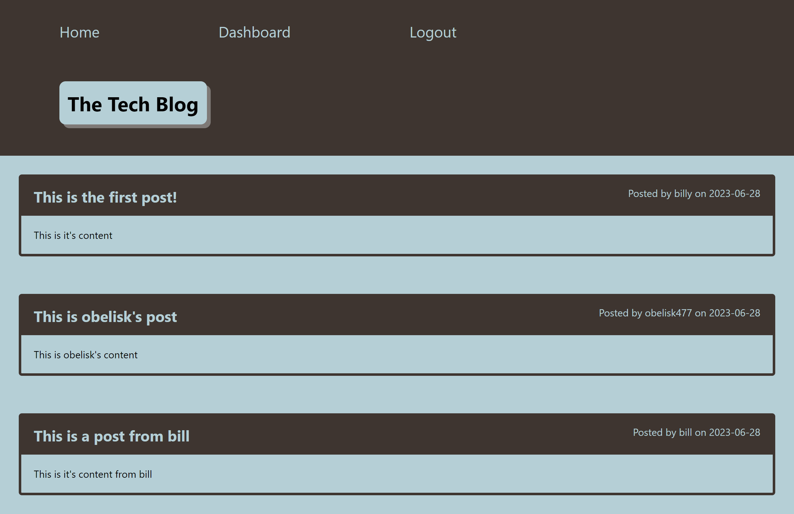

# The Tech Blog / Module 13

## Description

This application is a CMS-style blog that users across the web can login to and create posts and comment on the  posts of others. Posts on up to date tech topics are regularly submitted, and every time you login you can see the newest content sorted to the top of the home page -- though you can scroll to find old content you interacted with days ago as well and see any recent comments from other users.

On your own dashboard, you can create new posts, read your old posts, update your old posts, or delete your old posts. This will carry over to the homepage so that any actions taken in the dashboard will appear there as well.

 
 

## Usage

To use the application, simply navigate to it at http://tranquil-anchorage-68186-da8e0be5335a.herokuapp.com/. Upon arrival, you'll see some existing posts already on the home page from previous users. You can click in to each one to see the whole post and comments, but before interacting with them though, you'll have to login or signup.

Clicking on the login button in the navbar, you can login if you already have an account, or click the 'Sign Up Instead' link. Entering your credentials will create a new account, and will bring you to your own dashboard whenre you can manage your posts. Click on 'New Post' and you can create a new blog post and submit it right there. Then, when you navigate to the homepage, you'll see it listed right at the top. If you want to change it or delete it, you can do so by clicking on that post back in your dashboard.

You can also publicly interact with posts (your own or otherwise) by clicking on them (logged in) on the homepage and submitting a comment. Doing so will show that you made the comment, as well as putting a date for when you made the comment.

Finally, if you wish to logout, you can do so (while logged in) from the navbar at the top right. Alternatively, you will be automatically signed out after a fixed amount of time.

## Screenshot

## License

Please refer to the LICENSE in the repo.

## Credits

* MIT License generated by GitHub